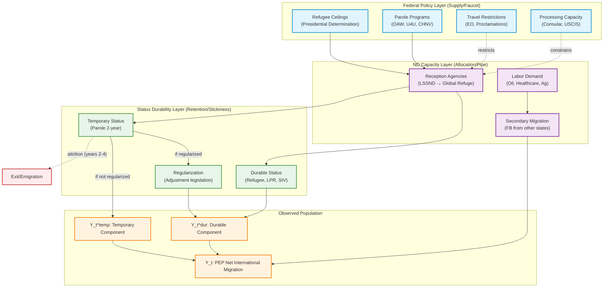
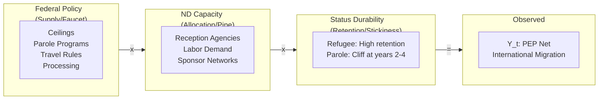
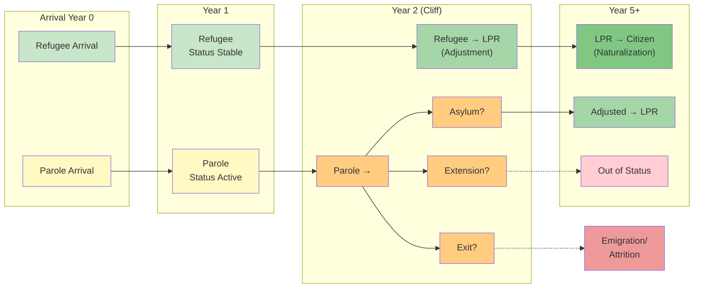
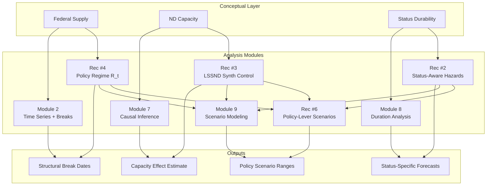

# Conceptual Diagram: Policy Mechanisms and Migration Flows

## Overview

This document provides a conceptual diagram showing the causal pathway from federal immigration policy to observed North Dakota net international migration. The diagram operationalizes the "faucet-pipe-stickiness" framework from the ChatGPT policy analysis (ADR-021 Recommendation #8).

**Key Insight**: ND's foreign-born inflow is governed by:
```
Inflow = Federal "Faucet" x State "Pipe Diameter" x Legal "Stickiness"
```

---

## Primary Conceptual Diagram



---

## Simplified Linear Diagram

For presentation contexts requiring a simpler view:



---

## Regime-Specific Pathway Diagram

Shows how the pathway operates differently across policy regimes:

```mermaid
flowchart TB
    subgraph Expansion["Expansion Regime (2010-2016)"]
        E_FED["High Ceilings<br/>(70K-110K)"]
        E_ND["LSSND Active<br/>Strong Reception"]
        E_STATUS["92% Refugee<br/>(Durable)"]
        E_OUT["Mean: 1,289/yr"]
        E_FED --> E_ND --> E_STATUS --> E_OUT
    end

    subgraph Restriction["Restriction Regime (2017-2020)"]
        R_FED["Low Ceilings<br/>(18K-45K)<br/>+ Travel Bans"]
        R_ND["LSSND Active<br/>Reduced Flow"]
        R_STATUS["~100% Refugee<br/>(Durable)"]
        R_OUT["Mean: 1,197/yr"]
        R_FED --> R_ND --> R_STATUS --> R_OUT
    end

    subgraph Volatility["Volatility Regime (2021-2024)"]
        V_FED["High Ceilings<br/>(62.5K-125K)<br/>+ Parole Surge"]
        V_ND["LSSND Closed<br/>Global Refuge<br/>Rebuilding"]
        V_STATUS["7% Refugee<br/>93% Parole/Temp"]
        V_OUT["Mean: 3,284/yr<br/>(but fragile)"]
        V_FED --> V_ND --> V_STATUS --> V_OUT
    end

    %% Styling
    classDef expansion fill:#c8e6c9,stroke:#388e3c
    classDef restriction fill:#ffcdd2,stroke:#c62828
    classDef volatility fill:#fff9c4,stroke:#f9a825

    class E_FED,E_ND,E_STATUS,E_OUT expansion
    class R_FED,R_ND,R_STATUS,R_OUT restriction
    class V_FED,V_ND,V_STATUS,V_OUT volatility
```



---

## Status Transition Hazard Diagram

Illustrates the "parole cliff" concept:



---

## Module Mapping Diagram

Shows how the conceptual framework maps to analysis modules:



---

## Usage Notes

### Rendering Mermaid Diagrams

1. **GitHub/GitLab**: Native rendering in markdown files
2. **VS Code**: Mermaid Preview extension
3. **Jupyter**: mermaid-python package
4. **Static Export**: Use mermaid-cli (`mmdc`) to export to PNG/SVG/PDF

### Export Command Example
```bash
# Install mermaid-cli
npm install -g @mermaid-js/mermaid-cli

# Export to PNG
mmdc -i conceptual_diagram.md -o conceptual_diagram.png -t dark

# Export to SVG
mmdc -i conceptual_diagram.md -o conceptual_diagram.svg
```

### LaTeX Integration

For LaTeX documents, use the TikZ version in `conceptual_diagram.tex` or export Mermaid to PDF/PNG and include as figure.

---

## Diagram Interpretation Guide

### Color Coding

| Color | Meaning |
|-------|---------|
| Blue | Federal policy layer |
| Purple | State capacity layer |
| Green | Durable status / positive outcomes |
| Yellow/Orange | Temporary status / uncertain outcomes |
| Red | Attrition / exit |

### Arrow Types

| Arrow | Meaning |
|-------|---------|
| Solid (-->) | Primary causal pathway |
| Dashed (-..->) | Constraint or negative effect |
| Multiplicative (x) | Interaction between factors |

---

*Document Version: 1.0*
*Created: 2026-01-02*
*ADR Reference: ADR-021 Recommendation #8*
